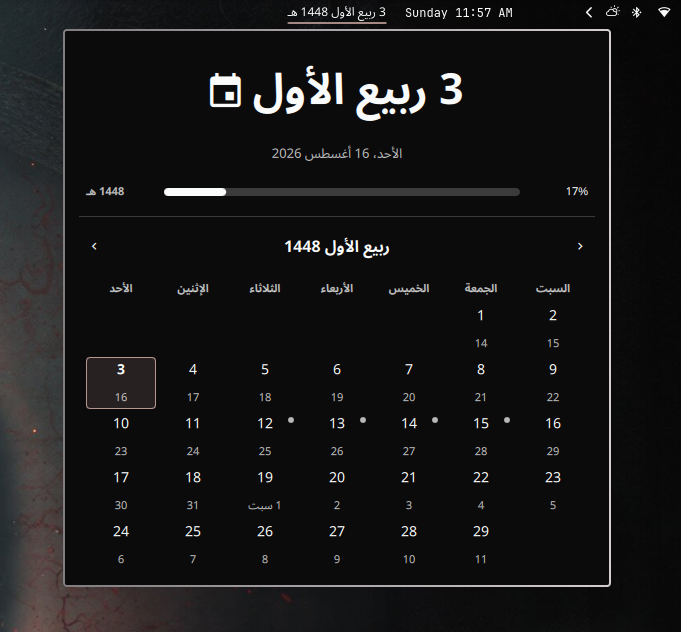

# Hijri Date for Omarchy

A native Omarchy Quattro bar widget with an offline Umm al-Qura Hijri calendar.
No network service, subprocess, package, or runtime dependency is required.

<p align="center">
  
</p>

## Features

- Arabic, English, Turkish, and Bengali dates
- Native or Latin numerals
- Full, compact, numeric, and month/day bar formats
- Optional full weekday and today's occasion beside the bar date
- Localized Hijri calendar with Gregorian dates in every cell
- Major and opt-in traditional Islamic occasion markers
- Saturday, Sunday, Monday, or locale-derived week start
- `−2` to `+2` local crescent-sighting adjustment
- Anchored or centered popup
- Horizontal and vertical Omarchy bars
- Mouse, keyboard, and shell IPC controls

## Install

```bash
omarchy plugin add https://github.com/RandaZraik/omarchy-hijri-date.git --enable
```

Place it immediately before the built-in clock:

```bash
omarchy bar move io.github.randazraik.hijri-date --before omarchy.clock
```

Replace `omarchy.clock` if you use a custom clock ID.

## Options

| Setting | Choices |
| --- | --- |
| Language | Auto, English, العربية, Türkçe, বাংলা |
| Numerals | Native, Latin |
| Bar format | Full, Compact, Numeric, Month and day |
| Show weekday | On, Off |
| Local adjustment | `−2` through `+2` days |
| Week starts on | Auto, Saturday, Sunday, Monday |
| Calendar markers | Major dates, Major + traditional, Off |
| Today's marker in bar | Off, Dot, localized Name |
| Panel position | Anchored, Centered |
| Font family | Empty to inherit Omarchy, or any installed font |

Configure through the bar editor or CLI:

```bash
omarchy bar set io.github.randazraik.hijri-date language العربية
omarchy bar set io.github.randazraik.hijri-date numerals Latin
omarchy bar set io.github.randazraik.hijri-date barMarker Name
omarchy bar set io.github.randazraik.hijri-date dayOffset 1
```

`Auto` language follows the desktop locale and falls back to English. On a
vertical bar, both `Dot` and `Name` use a compact dot.

## Controls

- Left click: open or close the calendar
- Right click: cycle the bar format
- Click a day: select it and show its occasion
- Left/right or `H`/`L`: previous/next month
- Up/down or `K`/`J`: previous/next year
- `T`: return to today
- `C` or Enter: copy the selected Hijri date
- Escape: close
- Tab/Shift+Tab: move between neighboring bar panels

## Markers

Major dates use the accent dot:

- Islamic New Year — رأس السنة الهجرية
- Ashura — عاشوراء
- Ramadan begins — بداية رمضان
- Eid al-Fitr — عيد الفطر
- Day of Arafah — يوم عرفة
- Eid al-Adha — عيد الأضحى
- Days of Tashriq — أيام التشريق

The optional traditional tier uses a muted dot and also includes:

- Mawlid — المولد النبوي
- Isra and Mi'raj — الإسراء والمعراج
- Mid-Sha'ban — ليلة النصف من شعبان
- 27th night of Ramadan — ليلة ٢٧ من رمضان
- White Days — الأيام البيض

- Select a marked day to see its localized name below the grid.
- Set `barMarker` to `Dot` or `Name` to show today's occasion beside the date.
- Traditional dates vary between communities; markers are reminders, not rulings.
- The local day adjustment moves the date, calendar, and markers together.

## Accuracy and maintenance

- Calendar: table-backed Umm al-Qura, not an approximate arithmetic formula.
- Source: KACST's official [Umm al-Qura Calendar](https://www.ummulqura.org.sa/en/annual-reference) and [date-conversion API](https://umqserv.kacst.gov.sa/api/v1/DateConversion/GetHijriMonthLengths), pinned on 16 August 2026.
- Range: 1 Muharram 1318–30 Dhu al-Hijjah 1500 AH, or 30 April 1900–16 November 2077 CE.
- Verification: CI checks all 183 year starts, 2,196 month lengths, official conversion anchors, and every one of the 64,850 supported days in both directions.
- Daily behavior: the displayed date advances automatically; no internet is needed.
- Marker behavior: fixed Hijri occasions recur automatically and follow the selected calendar date and local adjustment; they do not need annual edits.
- Source watch: monthly CI compares every bundled month length with KACST and checks boundary plus present-day conversion anchors.
- Future dates: KACST can revise a predicted boundary. CI will flag it, then the maintainer reviews the exact changes and publishes a release—there is no routine yearly table update.
- Local sightings: if an authority announces a different religious month start, the user changes `dayOffset`; the plugin author does not patch that year's calendar.
- Religious decisions: the Saudi Supreme Court, for example, [requests sighting reports before announcing Ramadan](https://www.spa.gov.sa/en/N2512732).
- Corrections or a post-2077 extension are versioned, tested, and reviewed—never silently downloaded at runtime.

## Updates

- A push makes new code available; it does not change installed copies.
- Omarchy does not currently announce individual plugin updates.
- To be notified, use GitHub **Watch → Custom → Releases** for this repository.
- Existing users update when they choose:

```bash
omarchy plugin update io.github.randazraik.hijri-date
```

- Omarchy shows the diff, asks for confirmation, then fast-forwards.
- Dates and yearly markers continue working offline without routine updates.
- For a KACST correction, the maintainer updates the pinned snapshot and bundled table, lists every changed boundary, runs the full suite, bumps `manifest.json`, and publishes a GitHub Release.

## Privacy

- No network requests, analytics, files, shell commands, or elevated privileges
- Clipboard access only after `C` or Enter
- Community plugins run unsandboxed inside `omarchy-shell`; review before enabling

## Development and CI

```bash
node --test tests/*.test.js
omarchy plugin validate .
/usr/lib/qt6/bin/qmllint -I /usr/share/omarchy/shell BarWidget.qml
/usr/lib/qt6/bin/qmllint -I /usr/share/omarchy/shell Panel.qml
```

- Every push and pull request runs the complete Node suite.
- Merging to `master` is another push, so CI runs again.
- Monthly CI compares all 2,196 month lengths and three conversion anchors directly with KACST; the regular suite derives and verifies all 183 year starts.
- The source check also has a manual **Run workflow** button.
- GitHub may pause schedules after 60 inactive days in a public repository; that pauses only the extra alert, not the plugin.
- Node and network access are CI-only; the installed plugin uses neither.

## Remove

```bash
omarchy plugin remove io.github.randazraik.hijri-date
```

## License and attribution

MIT licensed. Calendar data is attributed above to KACST's official Umm
al-Qura Calendar service.
